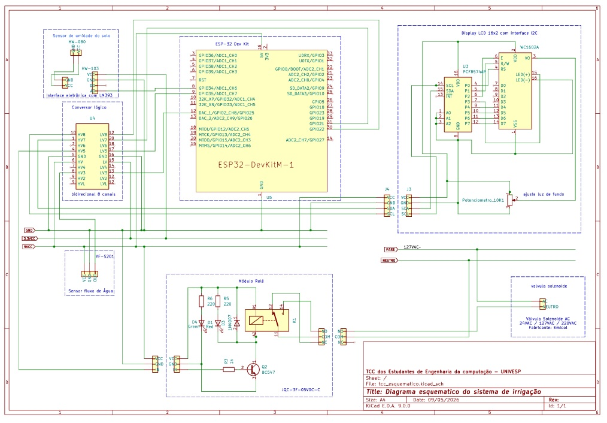

# SmartGarden (Jardim Inteligente)

Sistema de irrigação automatizada baseado em microsserviços, protocolo MQTT e decisão orientada a domínio.

O dispositivo IoT (ESP32) coleta leituras de umidade do solo e as encaminha ao backend via MQTT. O serviço de domínio decide se a rega deve ocorrer com base nos parâmetros agronômicos da planta, consultados na [Open PlantBook API](https://open.plantbook.io). O comando de irrigação retorna ao dispositivo via MQTT com um alvo de umidade para parada automática, evitando rega em loop.

---

## Arquitetura

```
ESP32 ──── MQTT ────► integration-service ──── AMQP ────► plant-management-service
  ▲                         │                                       │
  │                         │ REST                                  │ PostgreSQL
  └──── MQTT ───────────────┘                                       │
                             ▲                                      │
                             │ HTTP/REST                            ▼
                          Frontend                           Open PlantBook API
                          (Angular)
```

| Componente | Tecnologia | Porta |
|---|---|---|
| Broker MQTT | Eclipse Mosquitto 2 | 1883 |
| Broker AMQP | RabbitMQ 3 (+ management UI) | 5672 / 15672 |
| Banco de dados | PostgreSQL 16 | 5432 |
| Serviço de integração | Spring Boot 4 / Java 25 | 8081 |
| Serviço de domínio | Spring Boot 4 / Java 25 | 8082 |
| Interface web | Angular 19 / Node 22 | 4200 (dev) |

---

## Diagrama do Circuito

<!-- Insira aqui o diagrama do circuito (formato JPG) -->




---

## Hardware — Componentes do Dispositivo IoT

| Componente | Modelo | Quantidade |
|---|---|---|
| Microcontrolador | ESP32 DEVKIT V1 (36 pinos) | 1 |
| Sensor de umidade do solo | HW-103 (capacitivo, saída analógica) | 1 |
| Sensor de fluxo hídrico | YF-S201 (450 pulsos/litro) | 1 |
| Display | LCD 16x2 com módulo I2C (endereço 0x27) | 1 |
| Válvula solenoide | Solenoide 12V (normalmente fechada) | 1 |
| Módulo relé | Relé 5V NC, ativo em LOW | 1 |
| Fonte de alimentação | 12V para solenoide + 5V para ESP32 | 1 |
| Protoboard / PCB | — | 1 |
| Jumpers e cabos | Macho-macho e macho-fêmea | diversos |

### Mapeamento de Pinos

| Periférico | Pino ESP32 | Observação |
|---|---|---|
| Relé (válvula) | GPIO 26 | Saída digital — VALVE_ON=HIGH, VALVE_OFF=LOW |
| Sensor HW-103 | GPIO 34 | ADC1, input-only — não suporta saída |
| Sensor YF-S201 | GPIO 27 | Interrupção externa FALLING |
| LCD SDA | GPIO 21 | I2C padrão ESP32 |
| LCD SCL | GPIO 22 | I2C padrão ESP32 |

### Bibliotecas Arduino necessárias

Instale via Arduino IDE (Sketch → Incluir Biblioteca → Gerenciar Bibliotecas) ou via `arduino-cli`:

```bash
arduino-cli lib install "PubSubClient"
arduino-cli lib install "ArduinoJson"
arduino-cli lib install "LiquidCrystal I2C"
```

| Biblioteca | Autor | Versão mínima |
|---|---|---|
| PubSubClient | Nick O'Leary | 2.8 |
| ArduinoJson | Benoit Blanchon | 6.x |
| LiquidCrystal I2C | Frank de Brabander | 1.1.2 |

> As bibliotecas `WiFi.h`, `Wire.h` e `esp_task_wdt.h` são nativas do SDK ESP32 e não precisam ser instaladas separadamente.

---

## Firmware IoT — Compilação e Upload

### Pré-requisitos

- [arduino-cli](https://arduino.github.io/arduino-cli/latest/installation/) instalado
- Plataforma ESP32 instalada:

```bash
arduino-cli core update-index
arduino-cli core install esp32:esp32
```

### Configuração

Antes de compilar, edite as constantes no início do arquivo `firmware/smartgarden-esp32/smartgarden-esp32.ino`:

```cpp
// Wi-Fi
constexpr const char* WIFI_SSID     = "SUA_REDE_WIFI";
constexpr const char* WIFI_PASSWORD = "SUA_SENHA_WIFI";

// MQTT Broker (IP do host onde o Docker está rodando)
constexpr const char* MQTT_HOST = "192.168.1.100";

// Calibração do sensor HW-103 (ajustar conforme o hardware)
constexpr int SENSOR_DRY = 2800;  // leitura ADC com solo seco
constexpr int SENSOR_WET = 1100;  // leitura ADC com solo úmido
```

> **Calibração do sensor:** com o sensor no ar (solo seco), abra o Monitor Serial e leia o valor ADC. Repita com o sensor submerso (solo úmido). Use esses valores em `SENSOR_DRY` e `SENSOR_WET`.

### Compilar

```bash
arduino-cli compile \
  --fqbn esp32:esp32:esp32 \
  --build-path ./build \
  firmware/smartgarden-esp32
```

### Upload

```bash
arduino-cli upload \
  --fqbn esp32:esp32:esp32 \
  --port /dev/ttyUSB0 \
  --build-path ./build \
  firmware/smartgarden-esp32
```

> **Porta serial:** substitua `/dev/ttyUSB0` pela porta correta do seu sistema.
> - Linux: `/dev/ttyUSB0` ou `/dev/ttyACM0`
> - macOS: `/dev/cu.usbserial-XXXX`
> - Windows: `COM3` (verificar no Gerenciador de Dispositivos)

Para listar as portas disponíveis:

```bash
arduino-cli board list
```

---

## Backend e Frontend — Execução com Docker

### Pré-requisitos

- [Docker](https://docs.docker.com/engine/install/) >= 24
- [Docker Compose](https://docs.docker.com/compose/install/) >= 2.20

### 1. Clonar o repositório

```bash
git clone https://github.com/seu-usuario/smartgarden.git
cd smartgarden
```

### 2. Criar o arquivo `.env`

Crie o arquivo `.env` na raiz do projeto (mesmo diretório do `docker-compose.yml`) com o conteúdo abaixo. Consulte a seção [Exemplo de .env](#exemplo-de-env) para os valores.

### 3. Build

```bash
docker compose build --no-cache
```

### 4. Subir os serviços

```bash
docker compose up -d
```

### 7. Parar os serviços

```bash
docker compose down
```

Para remover também os volumes (banco de dados):

```bash
docker compose down -v
```

---

## Exemplo de `.env`

Crie o arquivo `.env` na raiz do projeto com o seguinte conteúdo. **Nunca versione este arquivo — ele já está no `.gitignore`.**

```env
# ==============================================================
# PostgreSQL
# ==============================================================
DB_HOST=postgres
DB_PORT=5432
DB_NAME=smartgarden
DB_USER=smartgarden
DB_PASS=smartgarden_secret

# ==============================================================
# RabbitMQ
# ==============================================================
RABBITMQ_HOST=rabbitmq-broker
RABBITMQ_PORT=5672
RABBITMQ_USER=guest
RABBITMQ_PASS=guest
RABBITMQ_VHOST=/

# ==============================================================
# MQTT (Eclipse Mosquitto)
# ==============================================================
MQTT_HOST=mqtt-broker
MQTT_PORT=1883
MQTT_USER=
MQTT_PASS=

# ==============================================================
# Open PlantBook API
# Obtenha seu token em: https://open.plantbook.io
# ==============================================================
PLANTBOOK_TOKEN=seu_token_aqui

# ==============================================================
# integration-service
# ==============================================================
AMQP_REPLY_TIMEOUT_MS=5000

# ==============================================================
# Irrigação — valores padrão quando a planta não tem care cadastrado
# ==============================================================
IRRIGATION_DEFAULT_MIN_SOIL_MOISTURE=30.0
IRRIGATION_DEFAULT_MAX_SOIL_MOISTURE=70.0
```

> **Token da Open PlantBook:** crie uma conta gratuita em [open.plantbook.io](https://open.plantbook.io) e gere um token de API. Sem o token, o cadastro de plantas funciona normalmente, mas sem enriquecimento de dados agronômicos.

---

## Fluxo de Cadastro

1. Suba o backend com `docker compose up -d`
2. Conecte o ESP32 à mesma rede WiFi e confirme que o deviceId aparece no LCD (ex: `esp-ddeeff`)
3. Acesse o frontend em http://localhost:4200
4. Na tela de plantas, clique em **Nova Planta**
5. Informe o nome popular (ex: `Samambaia`) — o backend traduz automaticamente para o nome científico e consulta a Open PlantBook
6. Selecione o dispositivo IoT na lista (o ESP32 auto-registrado aparecerá pelo deviceId)
7. Salve — a planta será vinculada ao dispositivo e o ciclo de irrigação automática estará ativo

---

## Autor

**Leandro F. Moraes**
[🔗 Linktree](https://linktr.ee/leandrofmoraes)

---

## Licença

Este projeto é desenvolvido como Trabalho de Conclusão de Curso.
